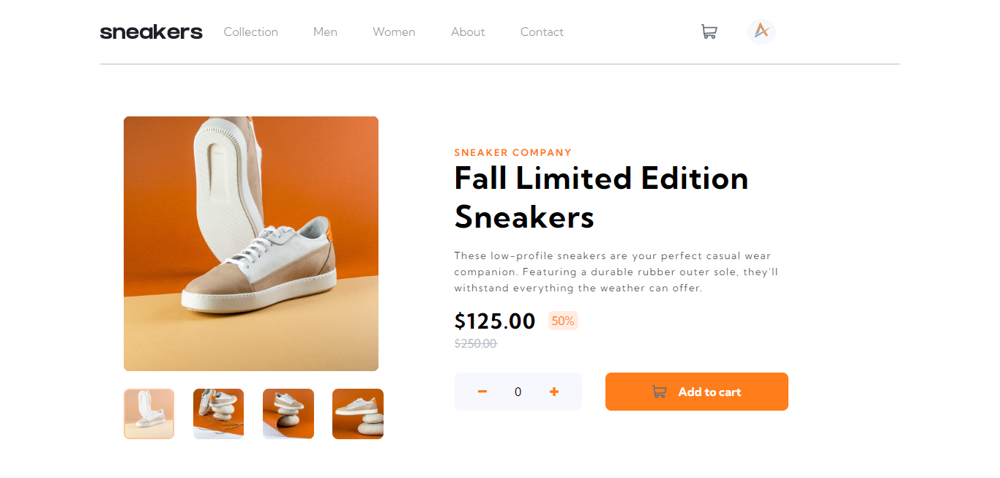
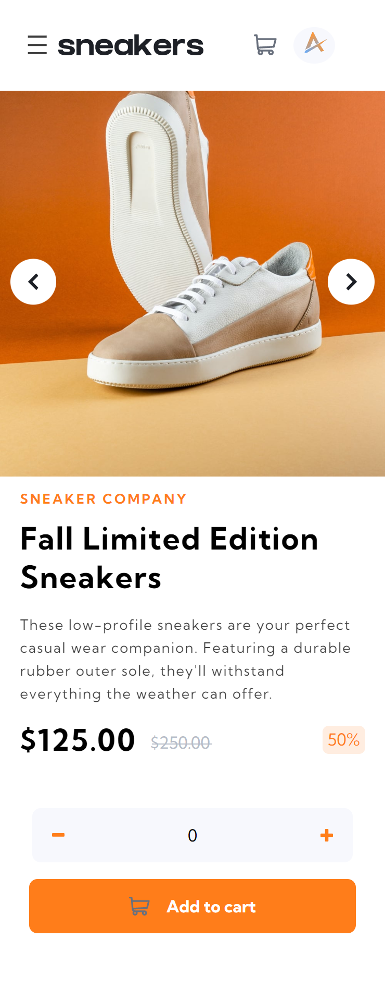

# E-commerce Product Page
 
 ## Table of Content

 * [Overview of the Project](#overview-of-the-project)
      * [Goal of the project](#goal-of-the-project)
      * [Screenshot](#screenshot)
 * [Technologies I Used](#technologies-i-used)
 * [Acknowledgment](#acknowledgment)

# Overview of the Project
This Project is a E-commerce Product Page with Cart Functionality and switching between images. You can check the Live site [here](https://ayush1m.github.io/E-commerce-Product-Page).

### Goal of the Project
* TO create a Responsive E-commerce Product page with cart Functionality.
* To switch large product image by clicking on thumbnail images.
* Add items to the cart.
* Remove items from the cart.
* Add a Carousel for mobile devices to slide through images.

## Screenshot

## Mobile

## Technologies I Used
* Semantic HTML5.
* CSS.
* JavaScript.

## Acknowledgment
   This is a solution to the E-commerce product page challenge on Frontend Mentor. Frontend Mentor challenges help you improve your coding skills by building realistic    projects.
